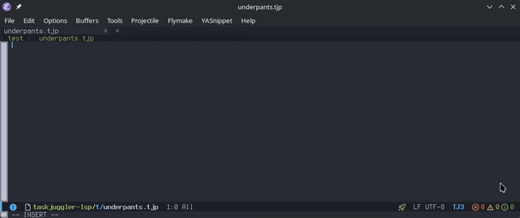

# taskjuggler-lsp

[](https://taskjuggler-lsp.readthedocs.io/en/latest/?badge=latest)

A [Language Server Protocol][] (LSP) server for [TaskJuggler][], written in C.



A **language server** is a background program that gives editors
language-aware features — completion, hover docs, go-to-definition,
find-references, diagnostics, rename, etc. — without each editor
having to reimplement them.

The server talks to the editor over the [Language Server Protocol
(LSP)][LSP Specification]. The editor sends events like "user opened
this file" or "cursor is here"; the server parses the code, maintains
its own model of the workspace, and replies with structured results
the editor renders.

This program implements that for TaskJuggler.

## Features

- Diagnostics: unresolved `depends`/`precedes` targets, out-of-scope relative refs, cross-file validation
- Hover and signature help for 39 TaskJuggler keywords
- Context-aware completion of keywords and identifiers, including hierarchical and relative (`!`) references
- Document and workspace symbols across all open and background-loaded files
- Go to definition and find references for `depends`/`precedes`, cross-file
- Document highlight, folding ranges, and semantic-token syntax highlighting
- Incremental document sync, file watching for `**/*.tjp` and `**/*.tji`, and rename tracking
- Transitive workspace loading via `include` directives

## Dependencies

- [yyjson](https://github.com/ibireme/yyjson)
- [Flex](https://github.com/westes/flex)
- [Bison](https://www.gnu.org/software/bison/)
- [Python](https://www.python.org/) (for running unit tests)
- [Valgrind](https://valgrind.org/) (for profiling)

On Debian/Ubuntu:

```sh
apt install libyyjson-dev flex bison
```

On Gentoo:

```sh
emerge -a dev-libs/yyjson sys-devel/flex sys-devel/bison
```

## Building

```sh
make
```

This produces the `taskjuggler-lsp` binary. To clean build artifacts:

```sh
make clean
```

## Testing

**`lsp_test.py`** — Golden-file test harness.

Replays a JSON message sequence against the server and diffs the
output against a recorded `expected.json`. Use `--record` to capture a
new golden file.

```sh
# Run all test cases:
python3 tools/lsp_test.py ./taskjuggler-lsp --all test/cases

# Record a new golden file for a single case:
python3 tools/lsp_test.py ./taskjuggler-lsp --record test/cases/hover_keyword
```

Test cases live under `test/cases/`. Each is a directory containing
`input.json` (the message sequence to send) and `expected.json` (the
golden output).

## Documentation

The published site at
<https://taskjuggler-lsp.readthedocs.io/> is built with
[Sphinx][] from the sources under `doc/`, with the API reference
section pulled in from [Doxygen][] XML via [Breathe][]. Both layers
can be built locally.

### Doxygen API reference

`doxygen` reads `Doxyfile` at the repo root and writes HTML and XML
output under `doc/_doxygen/`. The XML tree (`doc/_doxygen/xml/`) is
also what the Sphinx build consumes.

```sh
make docs           # equivalent to: doxygen Doxyfile
make docs-clean     # remove doc/_doxygen/
```

Open `doc/_doxygen/html/index.html` to view the API reference on its
own.

### Sphinx site

The Sphinx configuration lives in `doc/conf.py`. Python dependencies
are pinned in `doc/requirements.txt`:

```sh
pip install -r doc/requirements.txt
```

The Sphinx build depends on the Doxygen XML output, so run `make docs`
first (or whenever the C sources change), then run `sphinx-build`:

```sh
make docs
sphinx-build doc doc/_build/html
```

Open `doc/_build/html/index.html` to view the full site.

## Usage

Configure your editor to launch `taskjuggler-lsp` as the language
server for `.tjp` and `.tji` files. The server communicates over
standard input/output using the LSP JSON-RPC protocol.

See `doc/usage.rst` for more details on integrating with specific
IDEs.

## License

Copyright (C) 2026 Devrin Talen

This program is free software; you can redistribute it and/or modify
it under the terms of the GNU General Public License as published by
the Free Software Foundation; version 2 of the License. See
[LICENSE](LICENSE) for the full license text.

### Relationship to TaskJuggler

[TaskJuggler][] is copyright Chris Schlaeger and others, licensed
under GPLv2. This project is an independent implementation that
provides editor tooling for TaskJuggler's `.tjp`/`.tji` file
format. It is not a modified version of TaskJuggler and does not
include any TaskJuggler source code.

The file `test/tutorial.tjp` is an example project from the
TaskJuggler tutorial, copyright Chris Schlaeger, included here as a
test fixture under the terms of the GPLv2.


[Language Server Protocol]: https://microsoft.github.io/language-server-protocol/
[TaskJuggler]: https://taskjuggler.org/
[`taskjuggler-mode.el`]: https://github.com/devrintalen/taskjuggler-mode.el
[Sphinx]: https://www.sphinx-doc.org/
[Doxygen]: https://www.doxygen.nl/
[Breathe]: https://breathe.readthedocs.io/
[LSP Specification]: https://microsoft.github.io/language-server-protocol/specifications/lsp/3.17/specification/
